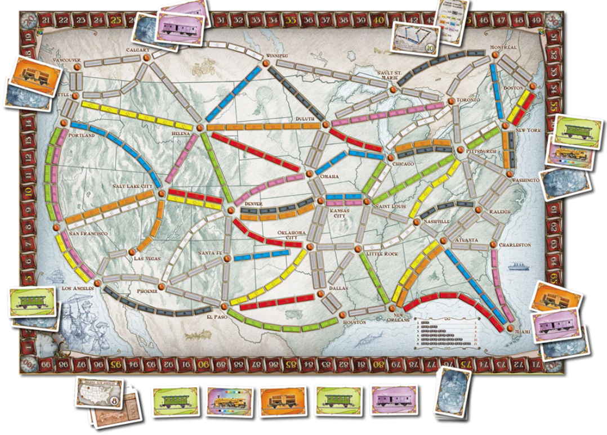
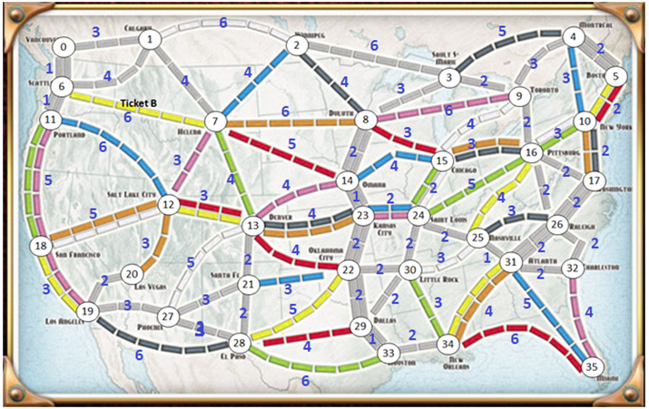

# Ticket to Ride Path Optimisation

## 1. Introduction

[Ticket to Ride](https://www.daysofwonder.com/tickettoride/en/usa/) is a popular board game that involves connecting cities in a given railroad network. We need to prototype some potential approaches for creating an AI player for this game (since the AI players for the computerised version are currently terrible!)

<p align="center"></p>
<br clear="left"/>

The basic gameplay of Ticket to Ride requires players to fulfil "tickets", which are randomly selected, by claiming the routes between cities.

-   A ticket consists of 2 cities that need to be connected (i.e. we need to claim routes to connect these 2 cities).
    -   Adjacent cities are connected by placing the required number of train tokens on the track.

While there are other complications in the full game, the basis of a good strategy is to fulfil as many of your tickets as possible using the least number of train tokens. Another way to score points is to complete the longest continuous path of routes. As a player only has a fixed number of train tokens available, wise management of tokens allows for the possibility of claiming other routes as well.

## 2. Create the Map

We can visualise the map as an undirected graph, where

-   the vertices represent the cities
-   the edges represent the routes between cities, and their weights represent the number of train tokens required to connect adjacent cities

The map above can be visualised as followed:
<p align="center"></p>
<br clear="left"/>

To create the map, the following input method is used:

-   The 1st line of input specifies the number of vertices (cities) in the graph.
-   The subsequent lines provide information about the edges for each vertex in the graph.
    -   Edges from a vertex are represented by **at most** 2 consecutive lines.
        -   Line 1: number of edges that start from this vertex to other vertices with a **higher index**. If this equals 0, no line 2 will be provided for this vertex.
        -   Line 2: information about the edges, represented in pairs "x,y", where "x" is the destination vertex (with a higher index) of the edge, and "y" is the weight (or cost) associated with that edge. Each pair is separated by a space.
    -   Note that the **input must only include edges from vertices with a lower index to vertices with a higher index** (e.g. from vertex 2 to vertex 7, not vice versa), to avoid duplication. As the map is an undirected graph, edges in other directions are added when the program reads the input.
-   The last 2 lines provide information about tickets to be fulfilled
    -   Line 1: number of tickets to be fulfilled,
    -   Line 2: information about the tickets, represented in pairs "a,b", where "a" and "b" are the cities for the ticket

For example, we have this input:

```{#numCode .R .numberLines}
7
2
6,4 3,3
2
4,4 2,1
2
5,2 3,3
2
6,2 4,5
1
6,3
0
0
2
2,4 0,1
```

This will create a graph of **7** cities (line 1).

-   Line 2, 3: Vertex 0 has 2 edges\*, one to vertex 6 with weight 4, and one to vertex 3 with weight 3
-   Line 4, 5: Vertex 1 has 2 edges\*, one to vertex 4 with weight 4, and one to vertex 2 with weight 1
-   Line 6, 7: Vertex 2 has 2 edges\*, one to vertex 5 with weight 2, and one to vertex 3 with weight 3
-   Line 8, 9: Vertex 3 has 2 edges\*, one to vertex 6 with weight 2, and one to vertex 4 with weight 5
-   Line 10, 11: Vertex 4 has 1 edge\*, to vertex 6 with weight 3
-   Line 12: Vertex 5 has 0 edges\*
-   Line 13: Vertex 6 has 0 edges\*
-   Line 14, 15: **2** tickets to be fulfilled, from cities 2 to 4 (green) and 0 to 1 (orange)

\* _to vertices with higher indices_


## 3. Solutions

The problem of finding the cheapest way to fulfil tickets is related to the minimum spanning tree (MST) problem. A naive solution might be to find the shortest path for each ticket and then add all of the paths together. However, for certain tickets, this may be very wasteful, as illustrated below.

-   In this case, the top map shows the shortest paths for tickets A and B, and the bottom map shows one way that these tickets can be fulfilled more efficiently.

<p align="center"></p>
<br clear="left"/>

So, the ticket fulfilment problem is related to the MST problem and also to the [Steiner tree problem](https://en.wikipedia.org/wiki/Steiner_tree_problem) of finding an MST for a subset of the vertices in the graph.

## 4. Program Output

After reading the map input, the program outputs the following:

-   MST for the map (using Prim's MST algorithm) and its total cost
-   Solution 1: Shortest paths combination using MST (naive solution) and total cost
-   Solution 2: Steiner tree solution and total cost

\* cost ~ train tokens required

Sample output:

